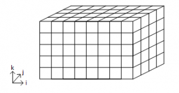

This is a rather short -- but useful -- project I did for a heat and mass transfer class within my Aerospace Engineering degree. I really enjoyed this class, so this project was one of my favorite parts of this course.

When selecting a suitable material for a certain application, its mechanical properties are one of the key decision makers. Mechanical properties can be altered by thermal processes, in which the material is heated and cooled at known (or predicted) rates, in order to modify what is known as the microstructure.

The tempering of steel is a thermal process in where hot steel is quickly cooled down in order to prevent it from cooling down in equilibrium. Typically, this process is performed in large pools of water that can absorb the material's heat without significantly altering its temperature. This process leads to a harder -- but more fragile -- steel known as martensite.

The cooling curve of an eutectoid steel is a very well-known topic to material researchers, and it depicts the microstructure formations given multiple different cooling curves.

This project aims to calculate the cooling profile of any point within a given prismatic steel part after it undergoes a tempering process. To solve this problem, we will enforce the heat transfer governing equation on the part, discretizing the its volume with a technique known as the finite volumes method.

As the cooling process is time dependent, we will use three methods of time discretization: implicit, explicit and Crank-Nicolson. We will define the discretized heat transfer equations with a variable to switch between time discretization modes, and see how it affects our results. We will solve this equation using the Gauss-Seidel iterative method, which is fairly rudimentary but yields acceptable results with little investment.

Let's get on it! First, let us start with a few assumptions:
<ul>
    <li>The piece is a 3-D rectangular prismatic part with known dimensions</li>
    <li>The thermal conductivity of the material is known and depends on its temperature</li>
    <li>The material‚ heat capacity is known and also depends on temperature</li>
    <li>The cooling fluid thermal diffusivity is known and depends on its temperature</li>
</ul>

A quick note on the notation I will be using when defining the governing equations per finite volume.

<ul>
    <li>When a variable is sub-indexed with i,j,k I will be referring to the state of the variable in the finite volume located at (i,j,k)</li>
    <li>When a variable is super-indexed with a vector, it will refer to the flux of said variable in the direction of the vector.</li>
</ul>

The equation governing heat transfer within the part can be defined as:

$$
\begin{align}
\frac{d}{dt}\int\limits_{VC}{\rho udV=\sum {\dot{Q}}_p}
\end{align}
$$

This equation is time dependent. For any given time frame n, we can approximate the equation above as:

$$
\begin{align}
\rho V_{i,j,k}\overline{C_{p(i,j,k)}}\left(T^{n+1}_{i,j,k}-T^n_{i,j,k}\right)=\mathit{\Delta}t\beta \sum {\dot{Q}}^{n+1}_{i,j,k}+\left(1-\beta \right)\sum {\dot{Q}}^n_{i,j,k}
\end{align}
$$

Where $\beta $ is the constant I mentioned earlier to switch between the 3 temporal discretization modes, $$C_p$$ is the specific heat of the material, $$\dot{Q}$$ is the heat flux, $\rho $ is the material density and $T$ is the temperature of the material.

We can break up the heat flux as the flux in each direction $\dot{Q}={{\dot{Q}}_{i,j,k}}^{\overrightarrow{i}}+{{\dot{Q}}_{i,j,k}}^{\overrightarrow{j}}+{{\dot{Q}}_{i,j,k}}^{\overrightarrow{k}}$ :

$$
\begin{align}
\begin{split}
&{{\dot{Q}}_{i,j,k}}^{\overrightarrow{i}}={\lambda }_{\left(i-1,j,k\right)-(i,j,k)}\frac{T_{i-1,j,k}-T_{i,j,k}}{d_{\left(i-1,j,k\right)-(i,j,k)}}S_{\left(i-1,j,k\right)-(i,j,k)}-{\lambda }_{\left(i,j,k\right)-(i+1,j,k)}\frac{T_{i,j,k}-T_{i+1,j,k}}{d_{\left(i,j,k\right)-(i+1,j,k)}}S_{\left(i,j,k\right)-(i+1,j,k)} \\
&{-T}_{i,j,k}\sum{\left(\frac{{\lambda }_{\left(i-1,j,k\right)-\left(i,j,k\right)}S_{\left(i-1,j,k\right)-\left(i,j,k\right)}}{d_{\left(i-1,j,k\right)-\left(i,j,k\right)}}+\frac{{\lambda }_{\left(i,j,k\right)-\left(i+1,j,k\right)}S_{\left(i,j,k\right)-\left(i+1,j,k\right)}}{d_{\left(i,j,k\right)-\left(i+1,j,k\right)}}\right)}+T_{i+1,j,k}\frac{{{\lambda }_{\left(i,j,k\right)-(i+1,j,k)}S}_{\left(i,j,k\right)-(i+1,j,k)}}{d_{\left(i,j,k\right)-(i+1,j,k)}} \\
&+T_{i-1,j,k}\frac{{\lambda }_{\left(i-1,j,k\right)-(i,j,k)}S_{\left(i-1,j,k\right)-(i,j,k)}}{d_{\left(i-1,j,k\right)-(i,j,k)}}
\end{split}
\end{align}
$$

$$
\begin{align}
\begin{split}
&{{\dot{Q}}_{i,j,k}}^{\overrightarrow{j}}={\lambda }_{\left(i,j-1,k\right)-(i,j,k)}\frac{T_{i,j-1,k}-T_{i,j,k}}{d_{\left(i,j-1,k\right)-(i,j,k)}}S_{\left(i,j-1,k\right)-(i,j,k)}-{\lambda }_{\left(i,j,k\right)-(i,j+1,k)}\frac{T_{i,j,k}-T_{i,j+1,k}}{d_{\left(i,j,k\right)-(i,j+1,k)}}S_{\left(i,j,k\right)-(i,j+1,k)} \\
&{-T}_{i,j,k}\sum{\left(\frac{{\lambda }_{\left(i,j-1,k\right)-\left(i,j,k\right)}S_{\left(i,j-1,k\right)-\left(i,j,k\right)}}{d_{\left(i,j-1,k\right)-\left(i,j,k\right)}}+\frac{{\lambda }_{\left(i,j,k\right)-\left(i,j+1,k\right)}S_{\left(i,j,k\right)-\left(i,j+1,k\right)}}{d_{\left(i,j,k\right)-\left(i,j+1,k\right)}}\right)}+T_{i,j+1,k}\frac{{\lambda }_{\left(i,j,k\right)-(i,j+1,k)S_{\left(i,j,k\right)-(i,j+1,k)}}}{d_{\left(i,j,k\right)-(i,j+1,k)}} \\
&+T_{i,j-1,k}\frac{{\lambda }_{\left(i,j-1,k\right)-(i,j,k)}S_{\left(i,j-1,k\right)-(i,j,k)}}{d_{\left(i,j-1,k\right)-(i,j,k)}}
\end{split}
\end{align}
$$

$$
\begin{align}
\begin{split}
&{{\dot{Q}}_{i,j,k}}^{\overrightarrow{k}}={\lambda }_{\left(i,j,k-1\right)-(i,j,k)}\frac{T_{i,j,k-1}-T_{i,j,k}}{d_{\left(i,j,k-1\right)-(i,j,k)}}S_{\left(i,j,k-1\right)-(i,j,k)}-{\lambda }_{\left(i,j,k\right)-(i,j,k+1)}\frac{T_{i,j,k}-T_{i,j,k+1}}{d_{\left(i,j,k\right)-(i,j,k+1)}}S_{\left(i,j,k\right)-(i,j,k+1)} \\
&{-T}_{i,j,k}\sum{\left(\frac{{\lambda }_{\left(i,j,k-1\right)-\left(i,j,k\right)}S_{\left(i,j,k-1\right)-\left(i,j,k\right)}}{d_{\left(i,j,k-1\right)-\left(i,j,k\right)}}+\frac{{\lambda }_{\left(i,j,k\right)-\left(i,j,k+1\right)}S_{\left(i,j,k\right)-\left(i,j,k+1\right)}}{d_{\left(i,j,k\right)-\left(i,j,k+1\right)}}\right)}+T_{i,j,k+1}\frac{{\lambda }_{\left(i,j,k\right)-(i,j,k+1)}S_{\left(i,j,k\right)-(i,j,k+1)}}{d_{\left(i,j,k\right)-(i,j,k+1)}} \\
&+T_{i,j,k-1}\frac{{\lambda }_{\left(i,j,k-1\right)-(i,j,k)}S_{\left(i,j,k-1\right)-(i,j,k)}}{d_{\left(i,j,k-1\right)-(i,j,k)}}
\end{split}
\end{align}
$$

Where $ \lambda$ is the thermal conductivity , $S$ is the surface area and d is the distance between two finite element volumes.

Let us define a compact form for terms of the equation above.

$$
\begin{align}
\begin{split}
&T^{n+1}_{i,j,k}\sum{\frac{\rho V_{i,j,k}\overline{C_{p\left(i,j,k\right)}}}{\Delta t}}+\beta (\frac{{{\lambda }_{\left(i-1,j,k\right)-\left(i,j,k\right)}}S_{\left(i-1,j,k\right)-\left(i,j,k\right)}}{d_{\left(i-1,j,k\right)-\left(i,j,k\right)}}+\frac{{\lambda }_{\left(i,j,k\right)-\left(i+1,j,k\right)}S_{\left(i,j,k\right)-\left(i+1,j,k\right)}}{d_{\left(i,j,k\right)-\left(i+1,j,k\right)}}+ \newline
&\frac{{\lambda }_{\left(i,j-1,k\right)-\left(i,j,k\right)}S_{\left(i,j-1,k\right)-\left(i,j,k\right)}}{d_{\left(i,j-1,k\right)-\left(i,j,k\right)}}+\frac{{\lambda }_{\left(i,j,k\right)-\left(i,j+1,k\right)}S_{\left(i,j,k\right)-\left(i,j+1,k\right)}}{d_{\left(i,j,k\right)-\left(i,j+1,k\right)}}+\frac{{\lambda }_{\left(i,j,k-1\right)-\left(i,j,k\right)}S_{\left(i,j,k-1\right)-\left(i,j,k\right)}}{d_{\left(i,j,k-1\right)-\left(i,j,k\right)}}+ \newline
&\frac{{\lambda }_{\left(i,j,k\right)-\left(i,j,k+1\right)}S_{\left(i,j,k\right)-\left(i,j,k+1\right)}}{d_{\left(i,j,k\right)-\left(i,j,k+1\right)}})=T^{n+1}_{i,j,k}\sum{a^{n+1}_p}
\end{split}
\end{align}
$$

So, for any non-limit point within the material we end up with:

$$
\begin{align}
T_{i-1,j,k}\beta \frac{{\lambda }_{\left(i-1,j,k\right)-(i,j,k)}S_{\left(i-1,j,k\right)-(i,j,k)}}{d_{\left(i-1,j,k\right)-(i,j,k)}}=T_{i-1,j,k}\sum{a^{n+1}_{i-1}}
\end{align}
$$

$$
\begin{align}
T_{i+1,j,k}\beta \frac{{{\lambda }_{\left(i,j,k\right)-(i+1,j,k)}S}_{\left(i,j,k\right)-(i+1,j,k)}}{d_{\left(i,j,k\right)-(i+1,j,k)}}=T_{i+1,j,k}\sum{a^{n+1}_{i+1}}
\end{align}
$$

$$
\begin{align}
T_{i,j-1,k}\beta \frac{{\lambda }_{\left(i,j-1,k\right)-(i,j,k)}S_{\left(i,j-1,k\right)-(i,j,k)}}{d_{\left(i,j-1,k\right)-(i,j,k)}}=T_{i,j-1,k}\sum{a^{n+1}_{j-1}}
\end{align}
$$

$$
\begin{align}
T_{i,j+1,k}\beta \frac{{\lambda }_{\left(i,j,k\right)-(i,j+1,k)S_{\left(i,j,k\right)-(i,j+1,k)}}}{d_{\left(i,j,k\right)-(i,j+1,k)}}=T_{i,j+1,k}\sum{a^{n+1}_{j+1}}
\end{align}
$$

$$
\begin{align}
T_{i,j,k-1}\beta \frac{{\lambda }_{\left(i,j,k-1\right)-(i,j,k)}S_{\left(i,j,k-1\right)-(i,j,k)}}{d_{\left(i,j,k-1\right)-(i,j,k)}}=T_{i,j,k-1}\sum{a^{n+1}_{k-1}}
\end{align}
$$

Finally,

$$
\begin{align}
\begin{split}
&T^{n+1}_{i,j,k}\sum{a^{n+1}_p}=T_{i-1,j,k}\sum{a^{n+1}_{i-1}}+T_{i+1,j,k}\sum{a^{n+1}_{i+1}}+T_{i,j-1,k}\sum{a^{n+1}_{j-1}}+ \\
&T_{i,j+1,k}\sum{a^{n+1}_{j+1}}+T_{i,j,k-1}\sum{a^{n+1}_{k-1}}+T_{i,j,k+1}\sum{a^{n+1}_{k+1}}+b^{n+1}_p
\end{split}
\end{align}
$$

On the next post, I will detail the specific equations for the prism's surface, along with any applicable boundary conditions. Then, we will be set to model this in C++ :)

$$
\begin{align}
T_{i,j,k+1}\beta\frac{{\lambda }_{\left(i,j,k\right)-(i,j,k+1)}S_{\left(i,j,k\right)-(i,j,k+1)}}{d_{\left(i,j,k\right)-(i,j,k+1)}}=T_{i,j,k+1}\sum{a^{n+1}_{k+1}}
\end{align}
$$

$$
\begin{align}
\left(1-\beta \right)\sum {\dot{Q}}^n_{i,j,k}+T^n_{i,j,k}\frac{\rho V_{i,j,k}\overline{C_{p(i,j,k)}}}{\Delta t}=b^{n+1}_p
\end{align}
$$

Finally,

$$
\begin{align}
\begin{split}
&T^{n+1}_{i,j,k}\sum{a^{n+1}_p}=T_{i-1,j,k}\sum{a^{n+1}_{i-1}}+T_{i+1,j,k}\sum{a^{n+1}_{i+1}}+T_{i,j-1,k}\sum{a^{n+1}_{j-1}}+ \\
&T_{i,j+1,k}\sum{a^{n+1}_{j+1}}+T_{i,j,k-1}\sum{a^{n+1}_{k-1}}+T_{i,j,k+1}\sum{a^{n+1}_{k+1}}+b^{n+1}_p
\end{split}
\end{align}
$$

On the next post, I will detail the specific equations for the prism's surface, along with any applicable boundary conditions. Then, we will be set to model this in C++ :)

