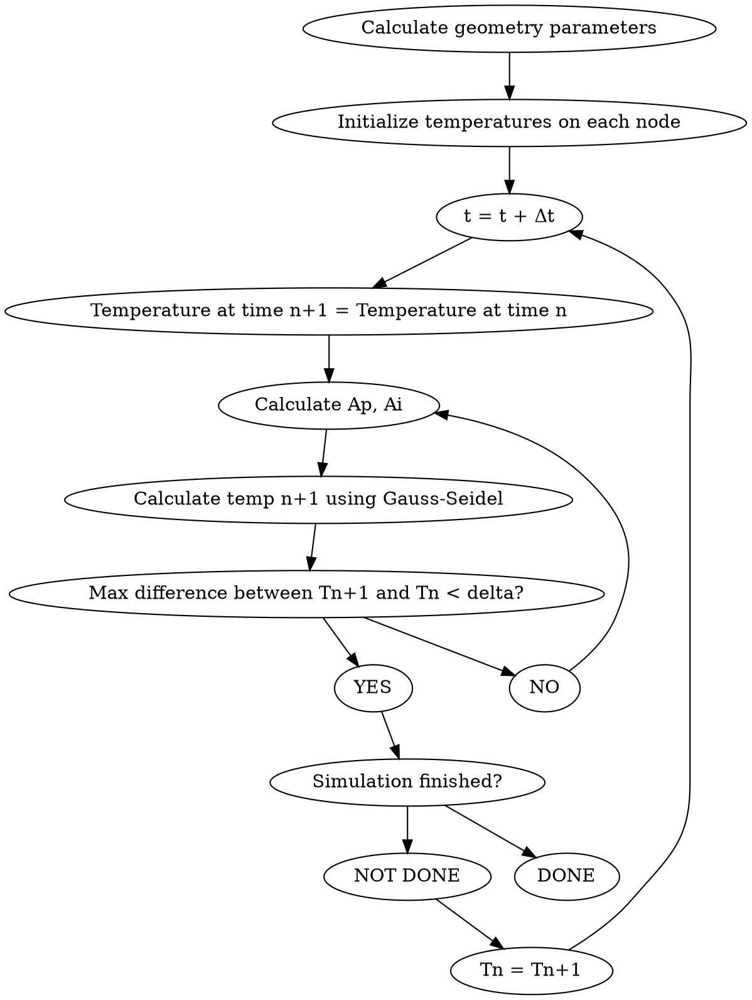

Phew, it has been a while since I last updated my blog. Sorry, world!

So, in my last post I (sort of) detailed a quasi-static mathematical model of the heat flow of a steel prism as it undergoes a quenching process.

In order to not be overly obnoxious with the mathematical formulae, I will use this post to explain how I approached this problem from a programming perspective.

Let's create a Flowchart depicting what our Gauss-Seidel solver will do to resolve the matrix-based equations we previously found:



We will initially model this problem using C++. As with any coding problem we face, we should aim to obtain a non-optimized solution to the problem first, then focus on optimizing this solution. 

The full version of all code used here can be found in my [Github](https://github.com/ebarti/DGTCM)

A naive implementation of a 3-D Matrix in C++ could be:
```cpp
class Matrix {
public:
  Matrix(unsigned int xSize, unsigned int ySize, unsigned int zSize, double initialValue) {
    m_matrix.resize(m_size_x);
    for (unsigned x = 0; x < m_matrix.size(); x++) {
        m_matrix[x].resize(m_size_y);
        for (unsigned y = 0; y < m_matrix[x].size(); y++) {
            m_matrix[x][y].resize(m_size_z, initialValue);
        }
    }
  }
  
private:
  std::vector<std::vector<std::vector<double>>> m_matrix;
}
```

This implementation has multiple issues: 
- Memory allocation is very inefficient, as we are allocating memory chunks iteratively, instead of a single call memory allocation. 
  
- Any operation we need to perform on a matrix will exhibit poor performance, since we must access three vectors to get to a single element.

To solve these problems, let's flatten this 3D matrix into a 1D vector, and define a mapping function, `at` that will map a 3-D element (x,y,z) into
an element number W in the 1D vector. 

```cpp
// Matrix.h
class Matrix {
public:
    Matrix(unsigned int xSize, unsigned int ySize, unsigned int zSize, double initialValue);
    double at(const unsigned &, const unsigned &, const unsigned &) const;
private:
    unsigned m_size_x;
    unsigned m_size_y;
    unsigned m_size_z;

    std::vector<double> m_matrix;
};

// Matrix.cpp
double Matrix::at(const unsigned int & x, const unsigned int & y, const unsigned int & z) const{
    return m_matrix[x + m_size_x * (y + m_size_y * z)];
}
```

// This is a work in progress :)
