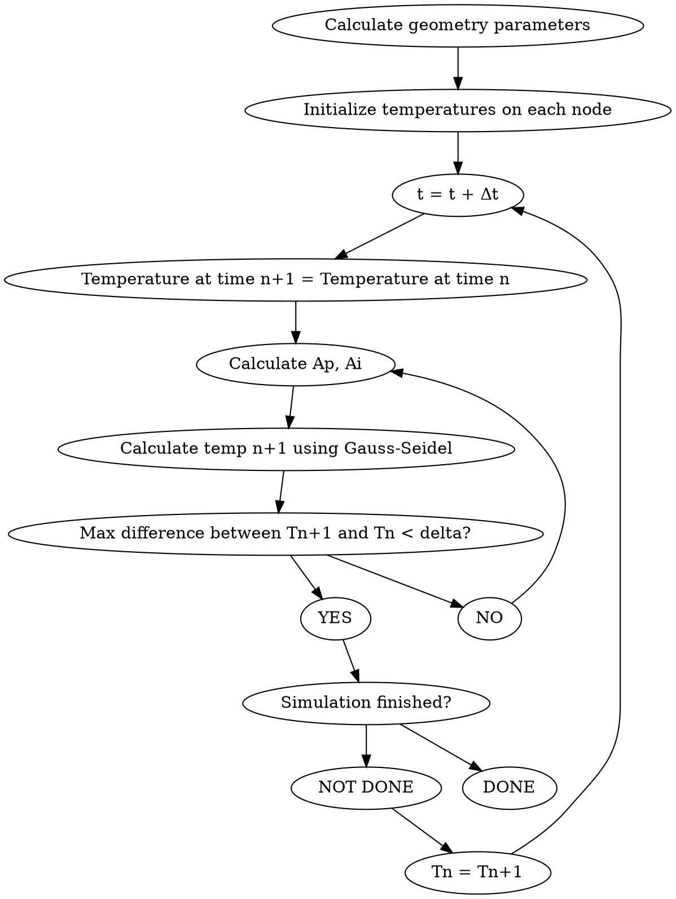

Phew, it has been a while since I last updated my blog. Sorry, world!

So, in my last post I (sort of) detailed a quasi-static mathematical model of the heat flow of a steel prism as it undergoes a quenching process.

In order to not be overly obnoxious with the mathematical formulae, I will use this post to explain how I approached this problem from a programming perspective.

### A Gauss Seidel Solver

Let's create a Flowchart depicting what our Gauss-Seidel solver will do to resolve the matrix-based equations we previously found:



_Note that the condition for simulation finished is a bit up in the air. In my case, I assume that the simulation is finished when the earliest of these two occurs:_
- Total simulation time has elapsed 300 seconds.
- The temperature differential between the inside and the outside of the prism is less than 30 degrees.
<br/>
We will initially model this problem using C++. As with any coding problem we face, we should aim to obtain a non-optimized solution to the problem first, then focus on optimizing this solution. 

The full version of all code used here can be found in my [GitHub](https://github.com/ebarti/DGTCM)

A naive implementation of a 3-D Matrix in C++ could look something like:

```cpp
class Matrix {
public:
  Matrix(unsigned int xSize, unsigned int ySize, unsigned int zSize, double initialValue) {
    m_matrix.resize(m_size_x);
    for (unsigned x = 0; x < m_matrix.size(); x++) {
        m_matrix[x].resize(m_size_y);
        for (unsigned y = 0; y < m_matrix[x].size(); y++) {
            m_matrix[x][y].resize(m_size_z, initialValue);
        }
    }
  }
  
private:
  std::vector<std::vector<std::vector<double>>> m_matrix;
}
```

This implementation has multiple issues: 
- Memory allocation is very inefficient, as we are allocating memory chunks iteratively, instead of a single call memory allocation.
- Any operation we need to perform on a matrix will perform poorly, since we must access three vectors to get to a single element.

To solve these problems, let's flatten this 3D matrix into a 1D vector, and define a mapping function, `at` that will map a 3-D element (x,y,z) into
an element number W in the 1D vector. 


```cpp
// Matrix.h
class Matrix {
public:
    Matrix(unsigned int xSize, unsigned int ySize, unsigned int zSize, double initialValue);
    double at(const unsigned &, const unsigned &, const unsigned &) const;
private:
    unsigned m_size_x;
    unsigned m_size_y;
    unsigned m_size_z;

    std::vector<double> m_matrix;
};

// Matrix.cpp
double Matrix::at(const unsigned int & x, const unsigned int & y, const unsigned int & z) const{
    return m_matrix[x + m_size_x * (y + m_size_y * z)];
}
```

Then, all we've left is to implement the Gauss Seidel iterative solver. In my implementation I decided to create a Solver class,
which takes some values driving convergence as parameters. It instantiates a physical model class, designed to describe
the geometric structure of the steel prism to quench.

When I originally built this project back in 2011, I could not get the solver to converge. It bugged me so much that 10 years later I
decided to try to implement it again, and finally found the root cause of the lack of convergence. You see, the [Gauss-Seidel](https://en.wikipedia.org/wiki/Gauss%E2%80%93Seidel_method) 
method's convergence is only guaranteed if the matrix is either strictly diagonally dominant, or symmetric and positive definite. 
This problem does fulfill those requirements, so what was the issue?

Let's take a look at this chunk of code, comments included:

```cpp
double Solver::Cp(unsigned int x, unsigned int y, unsigned int z) {
    //Cp = -5561.455 + 53.22458*temp - 0.1940006*temp^2 + 0.0003336*temp^3 - 2.548565e-7*temp^4 + 6.988594e-11*temp^5
    double temp = ActiveMatrix()->operator()(x,y,z);
    /*
     if(temp>1273.0) { return 350.0;}
    if(temp>1173.15 && temp<=1273.15) { return 1100.0;}
    if(temp>1073.15 && temp<=1173.15) { return 1800.0;}
    if(temp>973.15 && temp<=1073.15) { return 2400.0;}
    if(temp>873.15  && temp<=973.15) { return 2600.0;}
    if(temp>673.15  && temp<=873.15)  { return 2300.0;}
    if(temp>573.15  && temp<=673.15)  { return 1500.0;}
    if(temp>473.15  && temp<=573.15)  { return 900.0;}
    if(temp>373.15  && temp<=473.15)  { return 550.0;}
    if(temp>273.15  && temp<=373.15)  { return 150.0;}
      */
    //return 400.0;
    double Cp = -5561.455 + 53.22458*temp - 0.1940006*pow(temp,2.0) + 0.0003336*pow(temp,3.0) - 2.548565e-7*pow(temp,4.0) + 6.988594e-11*pow(temp,5.0);
    return Cp;
}
```


Initially, I had defined the thermal conductivity function as a non-continuous function. When running a simulation,
the nodes within the steel slowly made their way to lower temperatures, yielding situations where there would be neighboring
nodes with drastically different specific heats. When iterating on a given time step, the sudden changes of Cp meant the solver
got permanently stuck trying to resolve the temperatures for that specific time step.
