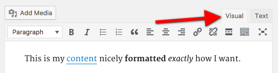

### Building my own website

Hello there! 👋🏼

Back in 2020 I decided to build my personal website. After a bit of research, and due to my lack of experience building
front-ends, I decided to go with WordPress. 

#### First attempt - WordPress

- GoDaddy as the domain registrar.
- DigitalOcean as my cloud provider: droplet with 1CPU, 1GB RAM and 25GB SSD running Ubuntu 18.04 LTS.
- WordPress as my CMS with various plugins, including Elementor to build the UI.



<div class="markdown_img_footer">WordPress' visual editor</div>

This setup had some **advantages** when compared to building the website from scratch:

- No need to learn front end at all. 😆
- WordPress as a CMS works pretty nicely - you get a Visual Editor, allowing you to build your content without any skills whatsoever.
- The Elementor plugin also allows you to build your UI with very little code, it is basically a low-code builder without many features, 
but it kind of works .

However, in my opinion, the **disadvantages outweigh the pros by far**:

- DigitalOcean's droplets are kind of expensive for what you get, and its initial setup is not so great. DigitalOcean now provides users with [one-click installations](https://www.digitalocean.com/solutions/wordpress-hosting) using Ubuntu 20.04 and WP 5.8, so you might want to consider using that if you decided this setup best fits your needs.
- You need to manage updates for WordPress and its plugins. Sure, you can turn on auto-update, but you're on your own in case something fails or there is an incompatibility between versions that yields your site unusable.
- WordPress' plugins are all paid. Yeah, they might have free versions, but you'll have to get your credit card ready in order to use fancier components. This makes sense, as most WordPress users have no alternative to plugins such as Elementor.
- The quality of the final product is 💩. You can indeed make nice looking sites with WordPress, but you'll probably need to become an expert in it, which is a complete waste of time. Do not learn WordPress, learn what it's used to build it.


#### Second attempt - Webflow to Gatsby

After about a year of struggling with WP, I "discovered" [WebFlow](https://webflow.com/). It surely is a way more powerful
low-code builder AND it also works as a CMS. Again, as with all low-code builders, you have to pay for the good stuff. However,
I took advantage of the free plan and designed my website's layout.
<br/>

At that point, I started researching front-end technologies. The space is huge, so I feared learning something that was either outdated
or would get outdated really soon. I started reading about [Jamstack](https://en.wikipedia.org/wiki/Jamstack) and its associated
frameworks, and decided to go for [Gatsby.js](https://www.gatsbyjs.com/). Nowadays, I'd probably go for Next.js instead, 
but I cannot unlearn what I've learnt. 🙃
<br/>

Exporting a WebFlow project generates a bunch of CSS, HTML, assets and JavaScript. Converting all of that into a format Gatsby could
understand was a bit tedious, so I tried my luck searching the web for someone who's built a tool to convert Webflow projects into Gatsby. 
I found [this](https://github.com/baptisteArno/webflow-to-gatsby) npm package which creates a base project for you and fixes paths of imports, etc.


<div class="markdown_img_footer">Webflow-to-gatsby's motto</div>

After [reworking it a bit](https://github.com/ebarti/webflow-to-gatsby-refactored/) and using it on my exported WebFlow project,
I started working on creating the interactivity part of my website. I knew I wanted to continue blogging, and I wanted to dynamically
generate blog posts based on markdown files placed in a given directory. A great tutorial to follow can be found in the 
[Gatsby documentation](https://www.gatsbyjs.com/docs/how-to/routing/adding-markdown-pages/). In essence:

1. Install the `gatsby-source-filesystem` plugin to read files.
2. Indicate what files need to be read in `gatsby-config.js`
3. Install `gatsby-transformer-remark` and configure it in `gatsby-config.js`
4. Your markdown data will be available using GraphQL. You can use this data in many ways: the way I used it in my initial implementation was by using `createPages`, one of Gatsby's Node APIs:

```javascript
exports.createPages = async ({ actions, graphql, reporter }) => {
  const { createPage } = actions
  const blogPostTemplate = path.resolve('./src/templates/blog-post.js')
  const blogListTemplate = path.resolve('./src/templates/blog-list.js')

  // this graphql is function string to pass graphql query, this is a node version of graphql
  // this query returns a promise of slugs. use then instead of async await
  return graphql(`
    query loadSlugQuery ($limit: Int!){
        allMarkdownRemark(
            sort: { fields: [frontmatter___date], order: DESC }
            limit: $limit
        ) {
            edges {
                node {
                    frontmatter {
                        title
                        slug
                    }
                }
            }
        }
    }
    `, { limit: 1000}).then(result => {
    const posts = result.data.allMarkdownRemark.edges
    posts.forEach((post, index) => {
      // create prev and next on each posts render (for Blog Post Pagination, BPP)
      const previous = index === posts.length - 1 ? null : posts[index + 1].node
      const next = index === 0 ? null : posts[index - 1].node

      // previous and next are objects props sent as pageContect object to blogPostTemplate
      createPage({
        path: post.node.frontmatter.slug,
        component: blogPostTemplate,
        context: {
          slug: post.node.frontmatter.slug,
          previous,
          next,
        },
      })
    })
    // Create blog list pages (for Blog List Pagination, BLP)
    // Assign path /2, /3, p/4, etc
    const postsPerPage = 6
    const numPages = Math.ceil(posts.length / postsPerPage)

    Array.from({ length: numPages }).forEach((_, i) => {
      createPage({
        path: i === 0 ? `/blog` : `/blog/${i + 1}`,
        component: blogListTemplate,
        context: {
          limit: postsPerPage,
          skip: i * postsPerPage,
          numPages,
          currentPage: i + 1
        },
      });
    });
  })
}
```
#### Third attempt - All in on Gatsby

The second version of my website was substantially better than the first one, but I was not totally 
happy with the interactivity and its layout. So I decided to explore a few Gatsby starter projects and 
themes, but nothing really caught my eye. Until I found [this blog](https://github.com/rolwin100/rolwinreevan_gatsby_blog), 
which looked pretty cool and was simple enough.


##### Welcome to dependency hell

When I looked at the blog I used as my base, I found all dependencies to be outdated by a few major versions, yikes. 
Not sure if the author just did not care to update them, or could not manage to update them, as it was a long, tedious process. 
Managing compatibility between major versions of packages in Javascript is just nuts. No one lists restrictions, 
documentation is scarce and time is of the essence, so you better just try to upgrade them and see what breaks. 

If you do not feel like playing the cat-and-mouse game with your dependencies, you can just go to the repository where I store 
all source code I use to build this blog [here](https://github.com/ebarti/eloibarti).

##### What's left to do

- This blog was built using [Antd Design](https://ant.design/), which I would like to transition to [Tailwind](https://tailwindcss.com/).
- The lighthouse report for this site lists a 77 on performance. That's not good. Sure, Google Analytics has a big performance hit, but there are a ton of low-hanging fruit issues waiting to be fixed.
- Lighthouse accessibility ratings are not much better: 90. This is a top priority for me to fix.


On my next post, I will be detailing my journey through the different, free sites & tools I used to build and host my website.

Cheers!

